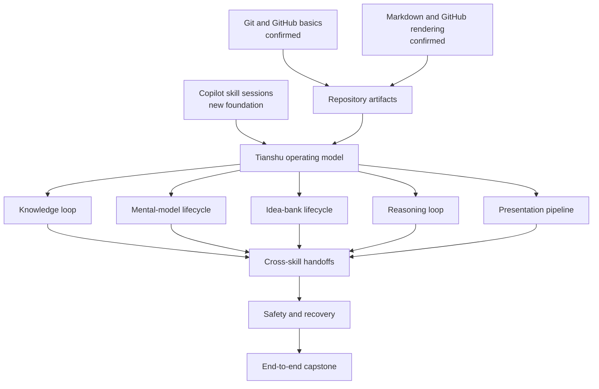

# Using Tianshu workflows and skills

This curriculum is for learners who know Git, GitHub, and Markdown but are new to GitHub Copilot App sessions and custom skills. Its goal is practical proficiency: choose the right Tianshu skill, navigate its questions and approval gates, inspect its durable artifacts, hand work to another skill deliberately, and recover without overwriting or fabricating work.

## Vocabulary

| Term | Meaning in this curriculum |
| --- | --- |
| Skill | A repository-provided instruction package that guides Copilot through a specialized workflow. |
| Session | A conversation attached to an isolated repository workspace where tools can create durable changes. |
| Tool | A capability Copilot uses to read, search, edit, execute, fetch, or call another service. |
| Canvas | An interactive side-panel surface whose state is distinct from the chat transcript and repository files. |
| Artifact | A durable file such as a lesson, lab report, mental model, idea record, design JSON, or presentation. |
| Gate | A required clarification, approval, validation, or safety decision that must pass before the workflow continues. |
| Handoff | A separate, explicit invocation that gives one skill's artifact to another skill; most Tianshu handoffs are not automatic. |

## Prerequisite and concept map

The confirmed foundations make repository artifacts readable; the new Copilot foundation makes the skills operable. The remaining concepts then progress from single-skill use to deliberate orchestration.

## Learner context and prerequisites

- **Confirmed:** Git and GitHub repository basics; Markdown and GitHub-rendered documents.
- **Needs a refresher:** None.
- **New foundation:** GitHub Copilot App conversations and custom-skill sessions.
- **Learning order:** Copilot skill sessions → Tianshu operating model → skill-family workflows → orchestration → recovery → capstone.

## Choose a track

| Track | Best for | Depth | Entry point |
| --- | --- | --- | --- |
| Quick | Becoming productive in one sitting | Essential operating model, selection rules, supported handoffs, and a guided recovery-aware run | [Quick track](quick/README.md) |
| Deep | Building a durable working model of every skill family | Individual mechanisms, contracts, edge cases, evidence rules, orchestration, and a capstone | [Deep track](deep/README.md) |

Both tracks begin with the same [Copilot skill sessions foundation](shared/01-copilot-skill-sessions.md), so the foundation is taught once without making either track depend on completing the other.

## Quick reading order

1. [Copilot skill sessions](shared/01-copilot-skill-sessions.md)
2. [Tianshu operating model](quick/01-tianshu-operating-model.md)
3. [Choose and chain skills](quick/02-choose-and-chain-skills.md)
4. [Guided run and recovery](quick/03-guided-run-and-recovery.md)

## Deep reading order

1. [Copilot skill sessions](shared/01-copilot-skill-sessions.md)
2. [System and artifact model](deep/01-system-and-artifact-model.md)
3. [Knowledge loop](deep/02-knowledge-loop.md)
4. [Mental-model lifecycle](deep/03-mental-model-lifecycle.md)
5. [Idea-bank lifecycle](deep/04-idea-bank-lifecycle.md)
6. [Reasoning loop](deep/05-reasoning-loop.md)
7. [Presentation pipeline](deep/06-presentation-pipeline.md)
8. [Cross-skill orchestration](deep/07-cross-skill-orchestration.md)
9. [Safety, recovery, and maintenance](deep/08-safety-recovery-and-maintenance.md)
10. [End-to-end capstone](deep/09-end-to-end-capstone.md)

## Maintenance notes

GitHub Copilot App, CLI commands, Agent Skills, and canvas behavior are version-sensitive. Host-specific claims in this curriculum use official GitHub documentation retrieved on 2026-08-19; revalidate them when the app or CLI changes. Tianshu workflow behavior is grounded in this repository's current `SKILL.md` contracts. The Knowledge Study canvas implementation and PPT Master's installed version are external boundaries, so validate their actual availability and behavior in the learner's environment.

## Primary sources

- [Tianshu repository overview](../../README.md)
- [About Agent Skills](https://docs.github.com/en/copilot/concepts/agents/about-agent-skills), GitHub Docs, retrieved 2026-08-19.
- [GitHub Copilot app](https://docs.github.com/en/copilot/concepts/agents/github-copilot-app), GitHub Docs, retrieved 2026-08-19.
- [Agent sessions in the GitHub Copilot app](https://docs.github.com/en/copilot/how-tos/github-copilot-app/agent-sessions), GitHub Docs, retrieved 2026-08-19.
- [Add Agent Skills to GitHub Copilot CLI](https://docs.github.com/en/copilot/how-tos/copilot-cli/customize-copilot/add-skills), GitHub Docs, retrieved 2026-08-19.

[Back to the learning library](../README.md)
