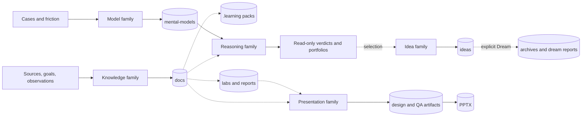

# System and artifact model

## Why it matters

Tianshu skills can all produce useful-looking prose, but their outputs do not have equal authority. Effective operation requires distinguishing canonical curriculum, deterministic derivatives, observed evidence, reusable reasoning, faithful idea records, audit trails, locked design representations, and final delivery files.

## Concrete anchor

Follow one topic from a source-backed lesson to a quiz pack, a lab report, a mental model used to judge product candidates, a captured idea, a Dream synthesis, and a presentation. If every file is treated as “content,” a generated quiz can drift into curriculum, a hypothesis can become a fact, or a slide can become the only surviving source. The system avoids that collapse by assigning ownership and mutation rules to each artifact class.

## Provisional mental model

Treat the system as a **factory line**: sources enter, skills transform them, and increasingly polished outputs emerge. This first model makes production steps visible, but it wrongly suggests a required linear order and a single definition of “finished.”

The diagram replaces the single line with the actual families and stores. Dotted edges are optional consumption or separately invoked handoffs.

## Core concepts and mechanism

Artifact authority depends on what produced the file and what evidence it preserves:

| Artifact class | Canonical owner | Regeneration or mutation rule | What it can establish |
| --- | --- | --- | --- |
| Learning topic under `docs/` | `learn` | Change only through approved curriculum work | Source-backed teaching claims and prerequisite order |
| Quiz pack under `.learning/quiz/` | Quiz adapter | Regenerate from lessons; never edit source docs | Deterministic assessment input, not new truth |
| Lab README | `practice` | Reusable protocol may be extended compatibly | What was planned and how to reproduce it |
| Lab report and evidence | `practice` | Preserve actual run, failures, and limitations | What was observed in one bounded environment |
| Mental-model artifact | `build-mental-model` | Approved refinement with dependency and regression checks | Reusable explanatory or decision reasoning with boundaries |
| Idea record | `idea` | New file with exact raw wording; never overwrite | What the user proposed and how it was neutrally understood |
| Dream archive/report | `dream` | Copy-and-verify before active removal; dated audit | Why synthesis or conservative archival occurred |
| Judge or brainstorm result | `judge` or `brainstorm` | Read-only until explicit capture selection | A traceable verdict or portfolio, not durable mutation |
| Presentation design IR | `knowledge-to-pptx` | Versioned and revalidated after material change | Locked provenance, narrative, style, and motion intent |
| PPTX | PPT Master through `knowledge-to-pptx` | Regenerate from validated design; final fidelity QA required | A delivery representation, not the canonical knowledge source |

The system operates through five invariants:

1. **Authority follows ownership.** A lab report can challenge a lesson, but it does not edit curriculum by itself. A Judge contribution can suggest a model refinement, but it is not canonical until the model workflow approves and writes it.
2. **Mutation is narrow.** `judge` is read-only; `brainstorm` remains read-only until candidate selection; `idea` writes one record; `dream` may mutate only its idea-bank and report scope; other skills own named roots.
3. **Gates match risk.** Curriculum and lab plans require visible approval, risky lab operations require focused confirmation, model artifacts require readiness and approval, and presentation generation requires multiple validation gates.
4. **Provenance survives transformation.** Lessons cite sources, labs separate expected from observed, models label epistemic status, Dream records derivation, and presentation design maps slide claims back to knowledge IDs.
5. **Terminal states remain honest.** `park`, `blocked`, `partial`, `failed`, and `no change` preserve useful information. Turning them into success-shaped files would destroy authority.

The system has no global transaction manager. A completed artifact becomes eligible input for another contract, but the next skill must be invoked separately unless a skill explicitly embeds the other contract, as `brainstorm` embeds per-candidate `judge`.

## Refined mental model

The factory analogy accurately highlights transformation and quality gates. It fails because the graph branches, artifacts have different authorities, and the learner may enter at many nodes. A practice lab can be standalone; a presentation can consume supplied knowledge directly; an idea can be captured without prior learning.

The refined model is a **governed artifact graph**. Every node has an owner, evidence type, mutation rule, validation rule, and downstream compatibility. Every edge is either internal composition, read-only consumption, or a separately authorized handoff. Before continuing, ask: “Which node is authoritative now, which owner may change it, and what evidence must survive?”

## Optional hands-on

Try it yourself

Inventory the existing DeepSeek Harness example without editing it. Classify its topic README, quick/deep lessons, presentation files, and any adjacent artifacts by owner, authority, regeneration rule, and evidence type. Mark any lifecycle stage that is not represented rather than inventing a missing artifact.

## Checkpoint questions

1. Why is a quiz pack less authoritative than its source lessons?

Show answer 1

The pack is a deterministic derivative containing selected lesson sections for assessment. It may be regenerated and does not own research or curriculum changes, while the approved `docs/` topic remains canonical.

2. Why can a failed lab report be stronger evidence than a successful command transcript?

Show answer 2

A proper report preserves the approved claim, environment, exact steps, observed behavior, contradictions, limitations, and cleanup. A command transcript alone may show only exit status and omit whether the semantic claim was tested.

3. In a new case, a slide contains a correct claim not present in its knowledge map. Is the deck acceptable?

Show answer 3

No. Correctness alone does not satisfy presentation provenance. The claim must enter the authoritative knowledge map with type, confidence, source, and uncertainty before slide design and generation are revalidated.

## Primary sources

- [Tianshu overview](../../../README.md)
- [Learning output contract](../../../.github/skills/learn/references/learning-output.md)
- [Quiz contract](../../../.github/skills/quiz/SKILL.md)
- [Lab output contract](../../../.github/skills/practice/references/lab-output.md)
- [Mental-model artifact system](../../../.github/skills/build-mental-model/references/artifact-system.md)
- [Dream contract](../../../.github/skills/dream/SKILL.md)
- [Presentation artifact contract](../../../.github/skills/knowledge-to-pptx/references/artifact-contract.md)

## Navigation

- [Prerequisite: Copilot skill sessions](../shared/01-copilot-skill-sessions.md)
- [Previous: Deep track index](README.md)
- [Next: Knowledge loop](02-knowledge-loop.md)
- [Deep track](README.md)
- [Topic root](../README.md)
- [Related quick module: Tianshu operating model](../quick/01-tianshu-operating-model.md)
