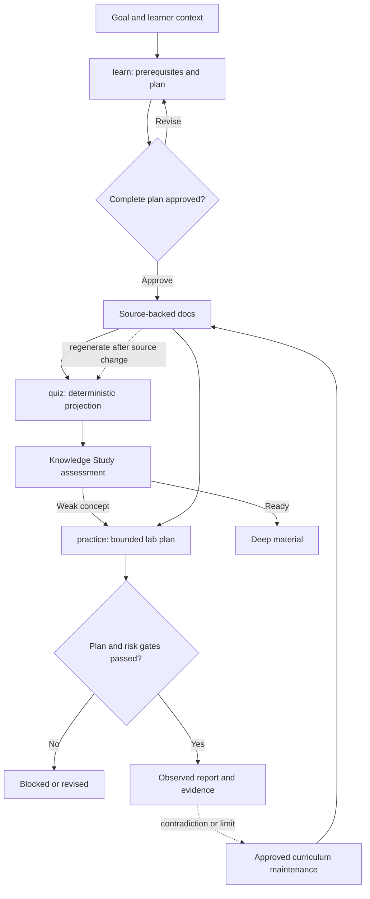

# Knowledge loop: learn, quiz, and practice

## Why it matters

Reading, recall, and empirical testing answer different questions. Tianshu keeps them connected without letting a quiz rewrite curriculum or a successful command masquerade as evidence, producing a loop in which sources establish claims, assessment locates weak areas, and practice tests meaningful behavior.

## Concrete anchor

Suppose you want to learn HTTP cache validation. You need prerequisite-aware lessons, a way to test whether you can reason about a new `ETag` case, and a lab that observes conditional requests. A weak workflow jumps directly to commands. The Tianshu loop first approves what will be learned, derives assessment from that material, then approves a bounded experiment with expected and negative outcomes.

## Provisional mental model

Treat the three skills as **textbook → exam → laboratory**. `learn` owns the textbook, `quiz` derives the exam scope, and `practice` owns the protocol and notebook. This model is provisional because assessment state is held by a canvas and the transitions are separately invoked rather than one automated course engine.

The loop shows both progression and evidence feedback:

## Core concepts and mechanism

The skills keep distinct contracts:

| Dimension | `learn` | `quiz` | `practice` |
| --- | --- | --- | --- |
| Main question | What must this learner understand, and in what order? | Can the learner explain and apply existing material? | Does a bounded claim hold in an observable environment? |
| Input | Topic, goal, learner state, sources | Existing indexed lessons | Learning claims or authoritative standalone foundations |
| Gate | Complete learner-facing plan before substantive research or writes | Ask only to resolve source ambiguity | Complete lab plan; focused confirmation for risky operations |
| Output | Canonical quick/deep curriculum under `docs/` | Manifest, knowledge pack, and canvas study state | Reusable README, factual report, optional evidence |
| Evidence boundary | Validated primary sources and labeled uncertainty | Selected source sections and stable hash | Exact actions, environment, observations, failures, and cleanup |
| Honest stop | Replan on new required prerequisite or unsupported section | Fail on ambiguous topic, malformed lesson, or unavailable boundary | `passed`, `failed`, `partial`, or `blocked` |

The mechanism has three phases:

1. **Compile the curriculum with `learn`.** Clarify only material ambiguity, discover required immediate prerequisites from sources, ask each canonical prerequisite once, and topologically order refresher and unknown concepts. Produce both quick and deep tracks with independent diagram and table decisions. Echo the entire plan and obtain explicit approval before substantive research or any `docs/` write. Research and author each module from a concrete anchor through a provisional model, connected mechanism, refined model with limits, practice, checkpoints, sources, and navigation.
2. **Project assessment input with `quiz`.** Resolve a unique topic, begin with quick-track lessons, read numbered modules in lexical order, and parse required headings rather than asking another model to summarize them. Build a stable manifest and `knowledge.md`, then open Knowledge Study. The adapter owns deterministic extraction; the canvas owns grounded question generation, interaction, progress, and mastery. The source lessons remain unchanged.
3. **Turn one claim into evidence with `practice`.** Resolve a bounded practical outcome, inspect tools and safety constraints, define semantic success and meaningful negative outcomes, specify evidence and cleanup, and obtain plan approval. Classify operations by risk and request focused confirmation for any risky command or target. Execute only the approved scope, preserve exact observations and contradictions, attempt cleanup, and write an honest terminal report even when blocked.

Feedback is deliberate rather than automatic. If practice contradicts a lesson, the report links the evidence and motivates a separately approved curriculum update. When relevant lesson sections change, regenerate the quiz pack so its hash and contents match the current source. Canvas mastery does not machine-trigger a lab, and practice may begin without quiz output when its foundations are authoritative.

## Refined mental model

The textbook-exam-laboratory analogy correctly separates pedagogical truth, assessment, and observation. It fails if the exam is assumed to include the entire textbook, if mastery automatically selects the lab, or if one experiment establishes universal truth.

The refined model is a **loosely coupled evidence loop**. `learn` owns source-backed explanation, `quiz` owns deterministic projection into an assessment surface, and `practice` owns an approval-scoped evidence transaction. Durable paths and explicit invocations connect them; contradictions travel back as evidence, not as silent edits.

## Optional hands-on

Try it yourself

Pick one existing lesson and trace a single claim through four representations: the original explanation, the sections a quiz pack should include, a transfer question that tests the claim in a new case, and a no-execution lab plan with one expected failure. State what evidence would justify maintaining the lesson and what would require an approved revision.

## Checkpoint questions

1. Why is a learner who “needs a refresher” treated as having planned prerequisite work?

Show answer 1

The learner cannot safely depend on that concept yet. Including it before its dependents preserves prerequisite order, while confirmed knowledge remains context rather than a redundant module.

2. Why must the quiz adapter parse lessons deterministically instead of summarizing them with another model?

Show answer 2

Deterministic projection preserves curriculum ownership, stable concept boundaries, source paths, and reproducibility. A fresh summary could introduce drift or unsupported claims and would blur which artifact is authoritative.

3. In a new case, a lab command exits successfully but the expected API state does not change. What is the correct outcome?

Show answer 3

The semantic success criterion failed. Record the command status and observed API state, diagnose only within scope, preserve contradictory evidence, clean up, and classify the run as failed or partial rather than passed.

## Primary sources

- [Learn skill](../../../.github/skills/learn/SKILL.md)
- [Prerequisite discovery](../../../.github/skills/learn/references/prerequisite-discovery.md)
- [Learning output contract](../../../.github/skills/learn/references/learning-output.md)
- [Quiz skill](../../../.github/skills/quiz/SKILL.md)
- [Quiz adapter](../../../.github/skills/quiz/scripts/build-knowledge-pack.mjs)
- [Practice skill](../../../.github/skills/practice/SKILL.md)
- [Execution safety](../../../.github/skills/practice/references/execution-safety.md)
- [Lab output contract](../../../.github/skills/practice/references/lab-output.md)

## Navigation

- [Prerequisite: System and artifact model](01-system-and-artifact-model.md)
- [Previous: System and artifact model](01-system-and-artifact-model.md)
- [Next: Mental-model lifecycle](03-mental-model-lifecycle.md)
- [Deep track](README.md)
- [Topic root](../README.md)
- [Related quick module: Guided run and recovery](../quick/03-guided-run-and-recovery.md)
