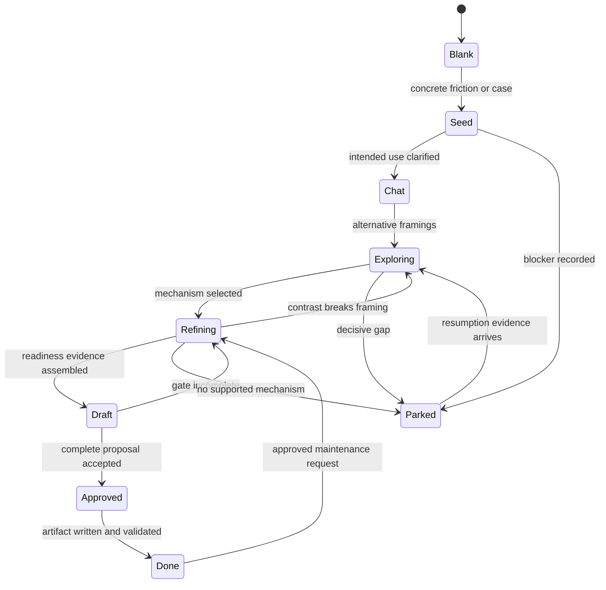

# Mental-model lifecycle

## Why it matters

A durable mental model must do more than sound insightful. Tianshu requires a concrete use, explainable mechanism, real case, boundaries, epistemic separation, dependencies, and a next test so the artifact can support later judgment without turning speculation into doctrine.

## Concrete anchor

A team notices that adding review steps sometimes improves reliability and sometimes only delays delivery. They want a reusable model for deciding when another gate helps. The initial observation is real but incomplete: the use is broad, causal mechanism is uncertain, and there is no contrast case. Persisting polished prose now would create a misleading “finished” model.

## Provisional mental model

Treat model development as a **maturity state machine**. A seed becomes a draft, stress testing exposes gaps, approval permits persistence, and later evidence can refine or park it. This is provisional because status indicates readiness for a stated purpose, not objective truth or quality.

The lifecycle contains both progress and honest loops:

## Core concepts and mechanism

Lifecycle stages guide the next smallest action:

| Stage | What exists | What is missing | Default next action |
| --- | --- | --- | --- |
| `blank` | Desire to form a model | Concrete signal or use | Find recurring decision, surprise, trade-off, or unstable rule |
| `seed` | One friction, observation, or claim | Clear use and mechanism | Capture one real case and intended decision |
| `chat` | Conversational framing | Independent artifact shape | Separate conditions, action, outcome, surprise, interpretation |
| `exploring` | Multiple plausible framings | Discriminator and evidence | Compare two to four mechanisms and stress with contrast |
| `refining` | Selected mechanism and case mapping | Complete readiness evidence | State boundary, epistemic status, open question, and next test |
| `draft` | Independently readable proposal | Learner approval or final validation | Present complete artifact and destination |
| `done` | Approved, validated artifact | Nothing for stated purpose | Use it within its limits; refine only through a new request |
| `parked` | Useful partial work plus blocker | Verdict-changing input | Preserve exact resumption condition without pretending completion |

The mechanism develops and protects an artifact:

1. **Start from a real use.** Resolve the decision, explanation, prediction, or coordination problem the model should improve. A memorable phrase without a use cannot pass readiness.
2. **Decompose one case.** Separate initial conditions, action or change, observed outcome, surprise, and interpretation. This keeps observation distinct from explanation.
3. **Generate materially different framings.** Each candidate states a minimal claim, maps to the case, names preserved and sacrificed detail, and supplies a discriminator. Paraphrases do not count as alternatives.
4. **Walk the mechanism.** For the chosen framing, explain how starting conditions lead through actions or relationships to the outcome. Mark where evidence ends and hypothesis begins.
5. **Stress the model.** Use a real contrast or clearly labeled illustration. Identify a boundary and the smallest test that could change confidence.
6. **Pass readiness.** Require concrete use, one-sentence operational model, mechanism, real case, boundary, epistemic table, open questions, next test, and independence from chat context.
7. **Choose artifact type.** A core model owns reusable canonical reasoning; an application consumes one or more cores in a bounded domain; a synthesis connects at least two standalone artifacts without erasing disagreement.
8. **Validate dependencies.** Read direct dependencies, confirm canonical claims, and keep semantic dependency edges acyclic. Navigation links may be bidirectional because they do not imply derivation.
9. **Approve before persistence.** Show the full artifact, destination, dependencies, status, and index changes. Material changes discovered after approval require renewed approval.
10. **Refine without regression.** Build a coverage ledger, check framing, completeness, canonicalization, duplication, links, and retained boundaries before optimizing brevity.

## Refined mental model

The state-machine model accurately captures readiness gates, loops, and parking. It fails if stages are interpreted as a universal measure of truth or as mandatory prose labels for every thought. A model can be useful while exploring, and `done` only means complete for its stated purpose under current evidence.

The refined operational model is: **use → case → competing mechanisms → discriminator → bounded mechanism → readiness → typed artifact → approved persistence → regression-safe refinement**. Each arrow must preserve epistemic status. When a later skill consumes the model, its verdict is only as strong as the model's relevant mechanism and boundary.

## Optional hands-on

Try it yourself

Use the review-gate anchor to draft two different one-sentence mechanisms: one based on information gain and one based on accountability. For each, map the same case, name one sacrificed detail, and propose a contrast that distinguishes them. Stop before choosing or saving an artifact.

## Checkpoint questions

1. Why can polished prose still fail the readiness gate?

Show answer 1

Readiness depends on operational use, mechanism, case, boundary, epistemic separation, open questions, and a next test. Style cannot replace any of those reasoning components.

2. Why is a bidirectional navigation link not necessarily a dependency cycle?

Show answer 2

Semantic dependencies state that one artifact derives or consumes a canonical claim and must remain acyclic. Navigation links only help readers move between related pages, so reciprocal links do not imply reciprocal derivation.

3. In a new case, later evidence invalidates the approved framing before the file is written. What happens?

Show answer 3

Stop, revise the framing and coverage ledger, and obtain renewed approval for the material change. Writing the previously approved but invalidated artifact would break the approval and evidence contract.

## Primary sources

- [Build mental model skill](../../../.github/skills/build-mental-model/SKILL.md)
- [Discovery and readiness](../../../.github/skills/build-mental-model/references/discovery.md)
- [Artifact system](../../../.github/skills/build-mental-model/references/artifact-system.md)
- [Refinement protocol](../../../.github/skills/build-mental-model/references/refinement.md)

## Navigation

- [Prerequisite: System and artifact model](01-system-and-artifact-model.md)
- [Previous: Knowledge loop](02-knowledge-loop.md)
- [Next: Idea-bank lifecycle](04-idea-bank-lifecycle.md)
- [Deep track](README.md)
- [Topic root](../README.md)
- [Related quick module: Choose and chain skills](../quick/02-choose-and-chain-skills.md)
