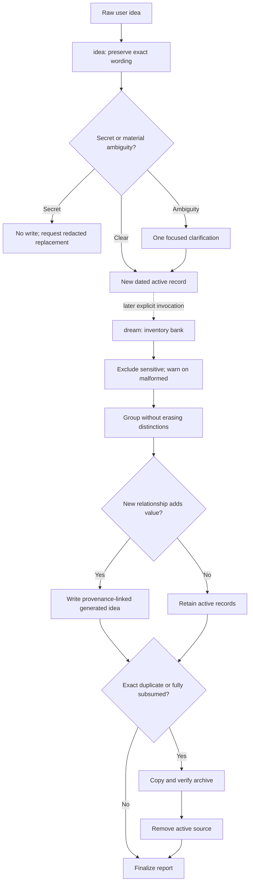

# Idea-bank lifecycle: idea and dream

## Why it matters

An idea bank is useful only if capture preserves what the learner actually meant and synthesis preserves where new relationships came from. Aggressive cleanup, silent rewriting, or weak provenance can make the bank smaller while destroying its memory.

## Concrete anchor

An active idea bank contains four records: two exact duplicates, one related but distinct proposal, and one malformed record that may contain a secret. The safe outcome is not “keep the best two.” The exact duplicate may be archived only after a deterministic survivor and verified archive copy exist; the related idea remains active; the malformed record remains in place with a warning; suspected-secret content is excluded from synthesis.

## Provisional mental model

Treat `idea` as a **fidelity-preserving intake desk** and `dream` as a **conservative curator**. Intake separates the original submission from neutral understanding; curation groups, synthesizes, and archives only when information is provably preserved. This model is provisional because Dream also writes an auditable run report and can finish with no changes or partial failure.

The lifecycle makes the separate invocations and safe write order explicit:

## Core concepts and mechanism

Classification determines allowed action:

| Relationship or condition | Dream action | Why |
| --- | --- | --- |
| Exact duplicate | Choose deterministic survivor; archive duplicate after verified copy | All meaning and wording are already preserved |
| Fully subsumed by one survivor | Archive only with explicit field-level preservation | One active record retains the complete idea |
| Thematically related | Keep all; aggregation may describe the connection | Similarity does not prove information preservation |
| Weak, old, or unpopular | Keep active | Subjective value and age are not archival criteria |
| Malformed | Retain and warn by path | Guessing structure could corrupt intent |
| Suspected secret | Exclude content and report safely | Reproduction would create a security incident |
| Useful new relationship | Create a new `Origin: Dream` record with `Derived from` links | Synthesis adds traceable value without rewriting sources |

The lifecycle has two ownership phases:

1. **Capture with `idea`.** Extract one identifiable raw idea and preserve wording, punctuation, order, and line breaks. Write a separate neutral understanding without expanding or evaluating it. Clarify intention only when competing interpretations materially change understanding. Choose `ideas/YYYY-MM-DD-<slug>.md`, adding `-2`, `-3`, and so on rather than overwriting. Scan for secrets before persistence, then verify raw fidelity and report the final path.
2. **Synthesize with `dream`.** Begin only on an explicit Dream invocation. Inventory active ideas, archives, and prior reports. Classify malformed and sensitive records without moving or exposing them. Form thematic aggregates while preserving distinctions. Select canonical survivors for exact duplicates deterministically. Generate an idea only when a relationship adds useful, traceable content. Deprecate only exact duplicates or records fully preserved by one survivor.
3. **Order mutation for recovery.** Create an in-progress dated report, write and verify generated ideas, copy and verify archives, then remove active source paths. This order ensures a failure leaves evidence and avoids permanent deletion.
4. **Close honestly.** Finalize the report as completed, no-change, or partial failure with generated, archived, retained, and warning paths. Dream never claims that similarity, age, or weakness justified removal.

## Refined mental model

The intake-and-curator analogy correctly separates fidelity from synthesis. It fails if the curator is imagined as a judge of quality or if “archive” implies permanent deletion. Dream is a provenance-preserving transformation with narrow deprecation criteria and recoverable copy-before-remove ordering.

The refined model is: **immutable raw meaning → neutral capture → active bank → explicit aggregate analysis → optional provenance-linked synthesis → proof of complete preservation → verified archive → audit report**. Capture and synthesis are separate invocations because their authority and risk differ.

## Optional hands-on

Try it yourself

Create five fictional idea summaries on paper: an exact duplicate, a full subsumption, a thematic relation, a malformed entry, and a suspected-secret entry. Classify the allowed Dream action and identify what evidence would be required before any active record could be removed.

## Checkpoint questions

1. Why is broad thematic coverage not full subsumption?

Show answer 1

Thematic coverage can share a topic while preserving different mechanisms, constraints, intentions, or wording. Full subsumption requires one survivor to retain the complete meaning of the candidate record, not merely its category.

2. Why must the archive copy be verified before removing an active source?

Show answer 2

Copy-and-verify ordering makes the operation recoverable. If writing or verification fails, the active source remains authoritative and the partial-failure report can identify the exact boundary.

3. In a new case, Dream generates a promising synthesis from three retained ideas. Must those source ideas be archived?

Show answer 3

No. A useful synthesis establishes a new relationship but does not prove that one new record fully preserves each source. Retain the sources unless exact duplication or full subsumption is demonstrated independently.

## Primary sources

- [Idea skill](../../../.github/skills/idea/SKILL.md)
- [Dream skill](../../../.github/skills/dream/SKILL.md)

## Navigation

- [Prerequisite: System and artifact model](01-system-and-artifact-model.md)
- [Previous: Mental-model lifecycle](03-mental-model-lifecycle.md)
- [Next: Reasoning loop](05-reasoning-loop.md)
- [Deep track](README.md)
- [Topic root](../README.md)
- [Related quick module: Choose and chain skills](../quick/02-choose-and-chain-skills.md)
