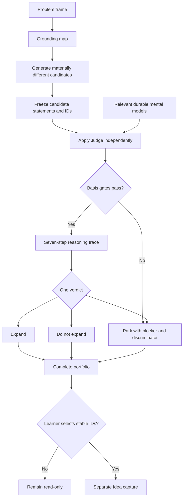

# Reasoning loop: brainstorm and judge

## Why it matters

Generating options and deciding whether to expand them are different reasoning tasks. Tianshu preserves candidate wording, grounds generation in repository knowledge, requires a durable model for substantive judgment, and keeps negative or parked results visible so enthusiasm cannot silently rewrite the evidence.

## Concrete anchor

A team wants to improve completion of a learning workflow. Repository lessons describe prerequisite overload, and a mental model explains feedback latency. Brainstorming produces three candidates: shorten initial lessons, add immediate diagnostic feedback, and send reminder notifications. The candidates differ in mechanism. Each must be judged unchanged for the intended use; the notification candidate may park if no relevant model supports its effect.

## Provisional mental model

Treat `brainstorm` as **controlled divergence** and `judge` as a **basis-gated proof obligation**. Brainstorm creates distinct branches; Judge admits a relevant model, walks its mechanism, and chooses one verdict for each branch. This is provisional because a candidate can be generated from knowledge even when no durable model exists, in which case substantive judgment parks.

The loop shows internal composition and the separate persistence boundary:

## Core concepts and mechanism

The contracts separate grounding, verdict, and persistence:

| Dimension | `brainstorm` | `judge` | `idea` handoff |
| --- | --- | --- | --- |
| Immediate intent | Produce materially different candidates for one problem | Decide whether one unchanged idea is worth expanding for one use | Preserve selected wording faithfully |
| Required basis | Repository knowledge sufficient for domain assumptions | Relevant durable model with mechanism and boundary | Identifiable raw idea without suspected secret |
| Core labels | Knowledge, fact, observation, model claim, inference, hypothesis, illustration | Premise status, mechanism step, boundary, discriminator, confidence | Raw idea, neutral understanding, intention |
| Mutation | Read-only portfolio | Read-only verdict | One new record after explicit selection |
| Honest negative | Stop when grounding cannot support generation | `do not expand` or `park` with reason | No write on ambiguity or secret |

The reasoning mechanism is:

1. **Frame one problem.** State desired outcome, audience, constraints, non-goals, and success conditions. Without a stable frame, candidates cannot be compared for the same use.
2. **Build a grounding map.** Read relevant `docs/` by learning goal, mechanism, prerequisites, and limits. Separate repository knowledge, verified external fact, user observation, model claim, inference, hypothesis, and illustration. External research is allowed only for a bounded gap that can change a candidate's judgment.
3. **Diverge by mechanism.** Generate three to five candidates by default, but keep fewer when evidence supports fewer. Merge paraphrases; retain differences in mechanism, intervention point, resource, feedback relationship, boundary, or discriminator.
4. **Freeze candidates.** Assign stable IDs and preserve wording during judgment. Silent improvement would make the verdict apply to a different proposal.
5. **Admit a Judge basis.** Match candidate models by intended use, mechanism, cases, boundaries, and dependencies rather than vocabulary. Read the complete model and canonical dependencies. No relevant durable model means `park`.
6. **Pass every basis gate.** Confirm identifiable idea, concrete intended use, durable basis, relevance, mechanism mapping, resolved boundary, and explicit premise status.
7. **Construct the reasoning trace.** State the idea claim, starting conditions, model mechanism, predicted consequence, boundary or contrast, decision implication, and smallest discriminator.
8. **Choose exactly one verdict.** `expand` requires a useful, nontrivial, testable consequence; `do not expand` requires a robust supported reason to stop; `park` records a verdict-changing unresolved issue.
9. **Report confidence and preserve negatives.** Confidence reflects support for the verdict, not excitement. The portfolio retains parked and rejected candidates so selection remains auditable.
10. **Persist only by selection.** After the complete portfolio is visible, ask which stable IDs should be captured. Pass only unchanged selected statements to `idea`.

## Refined mental model

Divergence and proof obligation accurately describe the two phases. The model fails if “proof” is read as mathematical certainty or if every candidate must have a positive verdict. Judgment is conditional on a model, intended use, evidence status, and discriminator; parking is often the rigorous result.

The refined operational model is: **frame → ground → diverge by mechanism → freeze → admit basis → trace consequence → expose boundary → choose verdict → compare portfolio → explicitly select persistence**. Brainstorm can generate from adequate domain knowledge without a model, but every such candidate parks during Judge until a relevant durable basis exists.

## Optional hands-on

Try it yourself

Using the completion anchor, draft three candidates that differ in mechanism. Freeze their wording, then judge each using only the feedback-latency model described in the anchor. Mark any unsupported candidate `park` and state the exact model or evidence needed to resume. Stop before selecting an idea for capture.

## Checkpoint questions

1. Why must candidate wording remain unchanged during Judge?

Show answer 1

The reasoning trace and verdict must apply to one stable claim. Improving the candidate during evaluation changes its mechanism or conditions and makes comparisons and provenance unreliable.

2. When is `park` preferable to `do not expand`?

Show answer 2

Use `park` when a basis gate or verdict-controlling fact remains unresolved, such as no relevant durable model or an unknown boundary. Use `do not expand` only when the available basis robustly supports stopping.

3. In a new case, a rejected candidate inspires an excellent derivative. Does that change the original verdict?

Show answer 3

No. The derivative is a new idea with its own conditions and mechanism. It may be reported or later captured, but it cannot retroactively upgrade the unchanged original candidate.

## Primary sources

- [Brainstorm skill](../../../.github/skills/brainstorm/SKILL.md)
- [Brainstorm protocol](../../../.github/skills/brainstorm/references/brainstorm-protocol.md)
- [Judge skill](../../../.github/skills/judge/SKILL.md)
- [Judgment protocol](../../../.github/skills/judge/references/judgment-protocol.md)
- [Idea skill](../../../.github/skills/idea/SKILL.md)

## Navigation

- [Prerequisite: Mental-model lifecycle](03-mental-model-lifecycle.md)
- [Previous: Idea-bank lifecycle](04-idea-bank-lifecycle.md)
- [Next: Presentation pipeline](06-presentation-pipeline.md)
- [Deep track](README.md)
- [Topic root](../README.md)
- [Related quick module: Choose and chain skills](../quick/02-choose-and-chain-skills.md)
