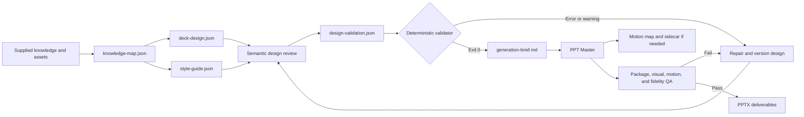

# Presentation pipeline: knowledge to PPTX

## Why it matters

A polished deck can still misstate sources, blur facts and inferences, violate accessibility, or lose design intent during generation. Tianshu prevents presentation quality from becoming a cosmetic afterthought by locking provenance, narrative, style, motion, and validation artifacts before PPT Master creates the binary file.

## Concrete anchor

Suppose a report contains two validated facts, one uncertain inference, and one unresolved conflict. You need a three-slide executive deck with restrained motion. A direct “make slides” prompt may present the inference as fact and omit the conflict. The Tianshu pipeline first assigns stable knowledge IDs and confidence, then maps every slide claim to those IDs before visual generation begins.

## Provisional mental model

Treat the workflow as a **compiler**: supplied knowledge becomes typed intermediate representations, validation checks their relationships, and PPT Master generates the native binary. This model is provisional because semantic review and visual fidelity require human or model judgment that deterministic schema checks cannot prove.

The pipeline separates design ownership from native implementation:

## Core concepts and mechanism

Each durable artifact owns one part of the contract:

| Artifact | Main responsibility | Blocking integrity rule |
| --- | --- | --- |
| `knowledge-map.json` | Source IDs, knowledge IDs, fact/inference type, confidence, conflicts, questions, omissions | Slide knowledge must trace to validated entries |
| `deck-design.json` | Narrative, slide purpose, takeaway, source references, visuals, layout, style version, motion intent | Every slide must satisfy the locked content and design schema |
| `style-guide.json` | Compared style candidates, chosen tokens, layouts, accessibility, assets, and motion system | Design and style versions and references must agree |
| `design-validation.json` | Evidence for semantic quality checks and resolved issues | All required checks need concrete evidence and no blockers |
| Validator result | Cross-artifact structural, reference, contrast, asset, and motion checks | Errors return 1; warnings return 2; only 0 permits generation |
| `generation-brief.md` | Frozen cross-system handoff to PPT Master | Paths, versions, slide intent, assets, citations, and targets must match validated IR |
| Motion map and sidecar | Design IDs to runtime animation provenance | Effect names and runtime mappings must match installed generator capabilities |
| `final-qa.json` | Content, file, visual, motion, accessibility, and design-fidelity evidence | Delivery occurs only when every applicable QA domain passes |

The mechanism proceeds through explicit ownership:

1. **Analyze knowledge.** Assign stable source and knowledge IDs. Separate facts, inferences, confidence, conflicts, open questions, and intentional omissions. Never let slide design become the first place a consequential claim appears.
2. **Design every slide.** Define narrative role, takeaway, source references, visual relationship, layout, style version, and motion decision. Graphics communicate relationships; decorative density does not count as explanation.
3. **Select and lock style.** Compare at least two coherent candidates, then lock tokens, layout families, variants, accessibility rules, asset policies, and a restrained motion system. Design references the locked style version.
4. **Perform semantic review.** Record concrete evidence for every required quality check, resolve issues, and preserve the review result in `design-validation.json`.
5. **Run deterministic validation.** Check schemas, IDs, versions, citations, contrast, assets, visual origins, motion duties, cue phrases, Morph adjacency, and other cross-artifact invariants. Warnings block because an unresolved ambiguity can become expensive or invisible after binary generation.
6. **Freeze the generation brief.** Record validated paths, versions, slide targets, assets, citations, and motion intent. This is the handoff boundary: PPT Master may implement the design but may not silently redesign it.
7. **Generate through PPT Master.** Detect and record the installed version and supported effect registry. The generator owns SVG/DrawingML, native animation, package construction, and its own gates. An implementation impossibility returns to design, version increment, revalidation, and regeneration.
8. **Verify actual delivery.** Read the package, render slides, inspect motion where applicable, compare against the locked artifacts, and record final fidelity QA. Preserve design artifacts if installation, attribution, routing, or playback fails.

> [!IMPORTANT]
> The Tianshu contract defines sibling artifact and deck destinations but does not specify a complete overwrite or collision policy for an existing presentation. Treat that as a contract boundary: inspect the destination and request an explicit strategy rather than assuming replacement.

## Refined mental model

The compiler analogy correctly captures typed intermediate representations, validation, and two-system ownership. It fails if deterministic validation is assumed to prove semantic truth or aesthetic quality. A schema can require review evidence but cannot independently prove that the evidence is honest or that a rendered slide communicates well.

The refined model is a **versioned design-to-implementation contract**. Tianshu owns provenance, narrative, style, and motion intent; PPT Master owns native realization; semantic review, deterministic checks, generator integrity, package inspection, rendering, and playback form separate gates. Any material repair restarts at the earliest artifact whose authority changed.

## Optional hands-on

Try it yourself

Draft a minimal three-entry knowledge map on paper: two facts and one inference with lower confidence. Design three slide takeaways and map each to knowledge IDs. Then introduce one missing source reference and one low-contrast style token, predict which validation stage should block them, and state the restart point. Do not generate a deck.

## Checkpoint questions

1. Why must inferences remain distinguishable from facts in the knowledge map?

Show answer 1

The distinction preserves epistemic status through slide design and prevents uncertainty from being promoted by visual polish. It also lets reviewers decide whether an inference belongs, needs qualification, or should be omitted.

2. Why do validator warnings block generation?

Show answer 2

Warnings represent unresolved design or integrity conditions that can become harder to diagnose after native generation. Requiring a clean exit prevents known ambiguity from entering the delivery artifact.

3. In a new case, PPT Master cannot implement the locked motion without breaking accessibility. May it choose a different animation silently?

Show answer 3

No. The implementation constraint must return to Tianshu's design artifacts, where motion intent or style is revised, versions are incremented, and validation runs again before regeneration.

## Primary sources

- [Knowledge-to-PPTX skill](../../../.github/skills/knowledge-to-pptx/SKILL.md)
- [Presentation artifact contract](../../../.github/skills/knowledge-to-pptx/references/artifact-contract.md)
- [Presentation quality rubric](../../../.github/skills/knowledge-to-pptx/references/quality-rubric.md)
- [Deterministic design validator](../../../.github/skills/knowledge-to-pptx/scripts/validate_design.py)
- [PPT Master repository](https://github.com/hugohe3/ppt-master), retrieved 2026-08-19.

## Navigation

- [Prerequisite: System and artifact model](01-system-and-artifact-model.md)
- [Previous: Reasoning loop](05-reasoning-loop.md)
- [Next: Cross-skill orchestration](07-cross-skill-orchestration.md)
- [Deep track](README.md)
- [Topic root](../README.md)
- [Related quick module: Tianshu operating model](../quick/01-tianshu-operating-model.md)
