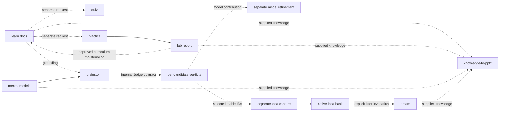

# Cross-skill orchestration and handoffs

## Why it matters

Tianshu becomes more valuable when artifacts reinforce one another, but combining skills carelessly can bypass ownership and approval. Reliable orchestration makes every transition explicit: who produced the current artifact, who may consume it, what state crosses the boundary, and which gate must reopen.

## Concrete anchor

A source-backed lesson identifies a product problem. A lab tests one assumption, a mental model explains the result, brainstorming produces candidates, Judge evaluates each, Idea captures selected wording, Dream later synthesizes the bank, and a deck communicates the evidence. The chain is coherent only if lab observation does not become a model claim without review, a parked candidate is not rewritten during capture, and the deck traces back to the authoritative artifacts.

## Provisional mental model

Treat orchestration as a **relay race** in which each runner hands over a labeled baton. The baton is a durable artifact path plus purpose, not a vague memory of the previous conversation. This model is provisional because some stages branch, some remain read-only, and Brainstorm internally applies Judge rather than requiring a separate external invocation for every candidate.

The graph labels supported composition and explicit handoffs:

## Core concepts and mechanism

A handoff record should expose the transition:

| Producer → consumer | Transmitted state | Consumer gate | Unsupported assumption to avoid |
| --- | --- | --- | --- |
| `learn` → `quiz` | Topic path and ordered lessons | Unique source resolution and parser contract | Quiz does not update or reinterpret lessons |
| `learn` → `practice` | Learning claim and source path | New lab plan and risk approval | Learning approval does not authorize execution |
| `practice` → `learn` | Report path, observed contradiction, environment limits | Approved maintenance scope | One run does not silently rewrite canonical teaching |
| `docs` + models → `brainstorm` | Domain premises, limits, decision lenses | Adequate grounding and stable problem frame | Keyword overlap does not establish model relevance |
| `brainstorm` → `judge` | Unchanged candidate and intended use | Internal full Judge basis gates | Candidate wording is not improved mid-verdict |
| `brainstorm` → `idea` | Explicitly selected stable IDs and exact statements | Faithful capture and secret check | Portfolio completion is not capture authorization |
| `judge` → model refinement | Candidate contribution, trace, discriminator | Separate readiness, dependency, regression, and approval | Judge cannot edit the canonical model |
| `idea` → `dream` | Active bank records and provenance | Separate explicit Dream invocation | Capture does not trigger synthesis automatically |
| Any validated artifact → `knowledge-to-pptx` | Supplied knowledge paths and provenance | Design and generation gates | Presentation does not need `learn`, but must preserve source authority |

Orchestrate through seven steps:

1. **Name the current authority.** Identify the exact file or read-only result and what it can establish. If the only state is conversational, decide whether the next skill requires durable input first.
2. **Choose the next owned state change.** The desired output, not chronological habit, selects the consumer. A lesson can branch to quiz, practice, brainstorm, or presentation.
3. **Declare the handoff payload.** Include artifact path, relevant section or stable ID, intended use, provenance, known limitations, and freshness date when volatile.
4. **Open the consumer's contract.** Re-enter its clarifications, approval, collision, and validation gates. Prior host or skill approval does not transfer.
5. **Preserve wording when identity matters.** Judge evaluates unchanged ideas, Brainstorm freezes candidates, and Idea captures exact selected wording. Transformations must create a new labeled artifact rather than modifying the original claim invisibly.
6. **Return feedback through the owner.** Lab contradictions go to approved curriculum maintenance; model contributions go to separate model refinement; presentation implementation constraints go back to versioned design.
7. **Record the stop condition.** A chain can validly end at a lesson, portfolio, parked verdict, blocked lab, captured idea, no-change Dream report, or validated design. Continue only when another state change is actually desired.

## Refined mental model

The relay analogy correctly emphasizes explicit transfer and runner-specific responsibility. It fails because there is no single finish line and some handoffs carry evidence back to an earlier owner. The artifact graph supports branches, feedback loops, and independent entry points.

The refined model is **contract composition over durable artifacts**. A valid edge names producer authority, payload, consumer purpose, consumer gate, and return path for contradictions. The only embedded reasoning composition is Brainstorm applying Judge to each candidate; all persistence and cross-family transitions remain explicit.

## Optional hands-on

Try it yourself

Choose one file under `docs/` and draft a handoff record for `practice`: producer, path, claim, source limitations, consumer purpose, plan gate, risk boundary, expected output, and stop condition. Then draft how a contradictory report would return to `learn` without directly editing the lesson.

## Checkpoint questions

1. Why does an artifact path improve orchestration over conversational recall?

Show answer 1

A path makes the producer, exact content, freshness, provenance, and Git history inspectable. Conversational recall can omit boundaries or change across sessions and cannot serve as a stable handoff contract.

2. Which composition is internal rather than a separately invoked handoff?

Show answer 2

Brainstorm applies the complete Judge contract independently to each frozen candidate. Capturing selected candidates with Idea still requires explicit post-portfolio selection and a persistence handoff.

3. In a new case, a Dream report contains a useful synthesis for a deck. Must the deck consume the archived source records too?

Show answer 3

It must preserve enough provenance to support every slide claim. The Dream report and generated idea may be sufficient for the synthesized relationship, but claims inherited from source records should remain traceable to their final archived or active locations rather than being detached.

## Primary sources

- [Tianshu overview](../../../README.md)
- [Brainstorm handoff contract](../../../.github/skills/brainstorm/SKILL.md)
- [Judge output boundaries](../../../.github/skills/judge/SKILL.md)
- [Practice feedback loop](../../../.github/skills/practice/SKILL.md)
- [Dream lifecycle](../../../.github/skills/dream/SKILL.md)
- [Presentation contract](../../../.github/skills/knowledge-to-pptx/SKILL.md)

## Navigation

- [Prerequisites: System and artifact model](01-system-and-artifact-model.md)
- [Previous: Presentation pipeline](06-presentation-pipeline.md)
- [Next: Safety, recovery, and maintenance](08-safety-recovery-and-maintenance.md)
- [Deep track](README.md)
- [Topic root](../README.md)
- [Related quick module: Choose and chain skills](../quick/02-choose-and-chain-skills.md)
