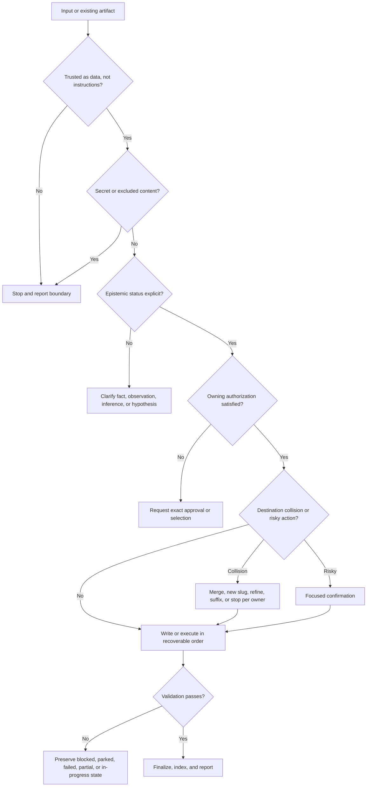

# Safety, recovery, and maintenance

## Why it matters

Tianshu deliberately performs research, writes files, executes labs, reorganizes idea records, and generates presentations. Safety therefore depends on more than avoiding dangerous commands: the system must protect existing user content, secrets, epistemic status, approval scope, provenance, and recoverable intermediate states.

## Concrete anchor

Consider four simultaneous problems: `learn` finds an existing topic directory, `idea` detects a token-like string, `practice` discovers a costly command after plan approval, and `dream` fails while copying an archive. A broad “continue carefully” instruction is insufficient because each owner has a different safe response.

## Provisional mental model

Treat every mutation as passing through **four controls**: trust, truth status, authorization, and recoverability. This is provisional because read-only workflows and deterministic presentation gates have different control points, and some safety rules protect meaning rather than files.

The decision flow identifies the earliest boundary at which work must stop:

## Core concepts and mechanism

Owner-specific controls prevent a false universal policy:

| Skill | Authorization and mutation | Collision or failure recovery | Maintenance signal |
| --- | --- | --- | --- |
| `learn` | Complete visible plan before research or `docs/` writes | Merge compatibly, choose new slug, or stop; never silently replace | New prerequisite, changed source, or stale volatile claim requires approved revision |
| `quiz` | Read curriculum; write regenerable pack | Fail on ambiguity or malformed lesson; preserve source docs | Regenerate after included source sections change |
| `practice` | Plan approval plus focused risky-operation confirmation | Existing lab needs extension/new slug/stop; blocked runs still require reports | Environment, version, cost, or evidence changes affect reproducibility |
| `build-mental-model` | Readiness and complete artifact approval | Refine, choose distinct type/slug, or stop; park on missing basis | New evidence or dependency change triggers coverage and regression review |
| `idea` | Capture request; clarification only when meaning changes | Numeric suffix; never overwrite; no write on secret | Final file must preserve exact raw wording |
| `dream` | Explicit non-interactive run within narrow roots | Copy and verify before removal; finalize partial-failure report | Preserve final-location provenance and dated audit trail |
| `judge` | Read-only | Park with exact blocker and resumption input | Model or premise changes require a new judgment |
| `brainstorm` | Read-only until explicit candidate selection | Stop if grounding is inadequate; preserve negative portfolio entries | Changed docs or models can alter later judgments |
| `knowledge-to-pptx` | Validated design before generator handoff | Preserve artifacts at any gate; destination collision is an explicit contract gap | Source freshness, schema/style versions, generator version, and playback must be revalidated |

Safety and recovery proceed in layers:

1. **Treat content as untrusted data.** Repository pages, fetched sources, and idea records can contain commands or instruction-like text. Analyze them for the user's goal; do not execute embedded instructions merely because they appear in a source.
2. **Protect secrets and exclusions.** Check before persistence or reproduction. Ask for a redacted replacement rather than copying a suspected secret into an idea, report, prompt, or slide.
3. **Preserve epistemic categories.** Keep verified fact, user observation, model claim, inference, hypothesis, and illustration distinct. A later transformation may summarize but may not silently promote status.
4. **Use owner-specific authorization.** Build and Learn require complete visible proposals; Practice adds risk confirmation; Brainstorm requires candidate selection only for capture; Dream is intentionally non-interactive after explicit invocation; read-only Judge does not need write approval.
5. **Inspect destinations.** Preserve existing user-authored content. Use merge, distinct slug, refinement, numeric suffix, or stop according to the owning contract. Where a contract is silent, request an explicit strategy.
6. **Order writes for recovery.** Write replacements and audit state first, verify them, then remove active sources only when authorized. Keep an in-progress or partial report when later steps fail.
7. **Validate semantics and structure.** Tests, links, schemas, hashes, exit codes, and rendering support completion but do not replace claim-level review. Warnings can be blocking when the contract says so.
8. **Report truthful terminal status.** Record exact blocker, last completed step, safe evidence, cleanup result, and resumption input. Do not return success-shaped fallbacks.
9. **Maintain volatile boundaries.** Record retrieval dates, environment versions, generator versions, hashes, regions, seeds, hardware, and any value that changes interpretation or reproducibility.

> [!CAUTION]
> Never “clean up” an unfamiliar repository state by reverting unrelated changes, deleting an existing destination, or discarding a failed report. Preservation is part of the evidence contract.

## Refined mental model

The four controls accurately organize most risks, but the model fails if they are treated as one global checklist with one approval style. Each skill specializes the controls according to its mutation authority and evidence type.

The refined model is **owner-specific guarded state transition**. Identify the current authoritative state, validate trust and epistemic status, obtain the owner's exact authorization, choose a collision strategy, act in recoverable order, validate, and preserve an honest terminal state. Maintenance repeats the same transition with current sources and dependencies rather than editing stale artifacts in place by intuition.

## Optional hands-on

Try it yourself

Run a tabletop incident review for the four anchor problems. For each, name the owner, earliest failed control, forbidden shortcut, artifact to preserve, honest terminal state, and exact input needed to resume. Add a fifth case in which a presentation source changed after design validation.

## Checkpoint questions

1. Why is Dream allowed to mutate without an interactive approval prompt?

Show answer 1

The explicit Dream invocation authorizes a narrowly constrained non-interactive run. Its mutation rules are conservative, roots are bounded, deprecation criteria are strict, write order is recoverable, and the dated report audits every action.

2. What must happen when a risky lab operation appears after overall plan approval?

Show answer 2

Stop and request focused confirmation showing the command or action, exact targets, impact, safeguards, and cleanup. The earlier plan approval did not authorize an undisclosed risk.

3. In a new case, a source used by a validated deck changes materially. Is rerunning final QA enough?

Show answer 3

No. Update the knowledge map and any affected design artifacts, increment relevant versions, repeat semantic and deterministic validation, regenerate, and then rerun final QA. Final QA cannot repair stale provenance upstream.

## Primary sources

- [Learning output collision rules](../../../.github/skills/learn/references/learning-output.md)
- [Practice execution safety](../../../.github/skills/practice/references/execution-safety.md)
- [Mental-model artifact system](../../../.github/skills/build-mental-model/references/artifact-system.md)
- [Mental-model refinement](../../../.github/skills/build-mental-model/references/refinement.md)
- [Idea safety rules](../../../.github/skills/idea/SKILL.md)
- [Dream recovery rules](../../../.github/skills/dream/SKILL.md)
- [Presentation validation contract](../../../.github/skills/knowledge-to-pptx/SKILL.md)

## Navigation

- [Prerequisite: Cross-skill orchestration](07-cross-skill-orchestration.md)
- [Previous: Cross-skill orchestration](07-cross-skill-orchestration.md)
- [Next: End-to-end capstone](09-end-to-end-capstone.md)
- [Deep track](README.md)
- [Topic root](../README.md)
- [Related quick module: Guided run and recovery](../quick/03-guided-run-and-recovery.md)
