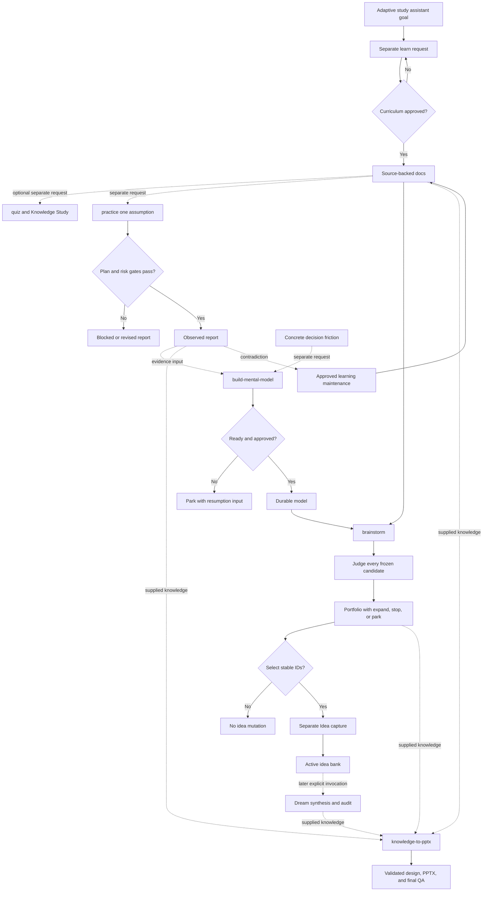

# End-to-end capstone

## Why it matters

The final skill is not memorizing nine workflows; it is composing them without inventing authority or automation. A capstone exposes whether you can predict gates and artifacts, preserve evidence and wording, stop honestly, and resume through the correct owner.

## Concrete anchor

Your team is considering an adaptive study assistant. The goal is to understand retrieval practice, test one product assumption, build a reusable feedback-latency model, generate implementation candidates, capture selected ideas, synthesize them with an existing bank, and create a decision deck. The capstone is complete even if a candidate parks or a lab blocks, provided the exact boundary and next input are preserved.

## Provisional mental model

Treat the capstone as a **knowledge-to-wisdom pipeline**: research creates knowledge, practice adds evidence, models organize reasoning, Brainstorm and Judge create decisions, Idea and Dream preserve possibility, and presentation communicates the result. This is provisional because each stage is separately invoked and optional; there is no automatic pipeline or guarantee that later stages are justified.

The flow labels approval and feedback boundaries:

## Core concepts and mechanism

Plan the capstone with explicit acceptance evidence:

| Phase | Owner and expected artifact | Gate or acceptance evidence | Valid stop |
| --- | --- | --- | --- |
| Learn | `learn`; indexed quick/deep topic | Approved complete plan, source validation, resolved links | Replan or report unsupported section |
| Assess | `quiz`; deterministic pack and canvas | Stable source resolution and grounded study input | Adapter or host boundary reported |
| Practice | `practice`; lab README, report, evidence | Approved semantic criteria, risk decision, actual observations, cleanup | `failed`, `partial`, or `blocked` report |
| Model | `build-mental-model`; typed durable artifact | Mechanism, case, boundary, epistemic table, next test, approval | `parked` with exact blocker |
| Generate and judge | `brainstorm` plus internal `judge`; complete portfolio | Distinct frozen candidates, basis gates, reasoning traces, one verdict each | Read-only portfolio with parked candidates |
| Capture | `idea`; selected dated records | Explicit stable IDs, exact raw fidelity, secret check | No selection or no write |
| Synthesize | `dream`; generated ideas, archives, audit report | Explicit run, provenance, conservative deprecation, verified copy order | No-change or partial-failure report |
| Present | `knowledge-to-pptx`; design IR, deck, final QA | Provenance, semantic review, validator exit 0, generator and fidelity gates | Preserved artifacts at failed gate |

Execute the capstone as separate contracts:

1. **Learn the domain.** Ask for a bounded goal such as “understand retrieval practice well enough to evaluate adaptive feedback timing.” Answer prerequisite questions, approve the complete curriculum, and inspect sources and artifacts.
2. **Assess only if useful.** Invoke `quiz` on the topic to locate a weak concept. Treat mastery as canvas-owned state and record the concept path manually for any later practice request.
3. **Test one assumption.** Invoke `practice` with a claim such as “immediate explanation after an error improves next-attempt correction in this prototype.” Define a meaningful negative outcome and do not generalize beyond the environment.
4. **Build reasoning from a case.** Invoke `build-mental-model` around a recurring decision such as “when should feedback interrupt practice?” Use lab evidence as one case, compare mechanisms, pass readiness, and approve the artifact. Park if no bounded mechanism survives contrast.
5. **Generate and judge options.** Invoke `brainstorm` with the repository lessons, model paths, outcome, constraints, and non-goals. Confirm that every candidate differs in mechanism and receives an independent Judge verdict without wording changes.
6. **Choose persistence deliberately.** Select only stable candidate IDs worth preserving. Let `idea` create faithful records; do not discard parked or rejected portfolio entries merely because they were not captured.
7. **Synthesize later, not automatically.** On a separate Dream invocation, inspect the active bank, create only provenance-linked synthesis, and archive only exact or fully subsumed records after verified copies exist.
8. **Compile the decision deck.** Supply authoritative lesson paths, the lab report, mental model, portfolio, and Dream report as appropriate. Keep facts, observations, model claims, and inferences typed in the knowledge map. Pass every design, generator, package, visual, motion, and fidelity gate.
9. **Close feedback loops through owners.** If lab evidence contradicts a lesson, request approved curriculum maintenance and regenerate affected derivatives. If Judge exposes a model gap, start a separate refinement. If presentation implementation breaks design, revise and revalidate the design artifacts.

The capstone is not required to traverse every optional stage. Completeness means every chosen transition has authority, evidence, and a valid stop—not that every skill produced a file.

## Refined mental model

The pipeline analogy usefully orders the story from knowledge to communication. It fails if it implies irreversible forward motion or automatic handoffs. Evidence can return upstream, missing models can park judgment, and a valid workflow may end before capture, synthesis, or presentation.

The refined model is a **network of separately authorized learning and decision experiments**. Durable artifacts carry typed state; owning skills govern mutation; read-only reasoning exposes uncertainty; feedback returns through the owner; and terminal states preserve what is known. You are operating Tianshu effectively when you can predict every artifact and gate before invocation and explain every missing artifact afterward.

## Optional hands-on

Try it yourself

Run a paper simulation of the adaptive study assistant capstone. Assign fictional paths and stable IDs, write the exact invocation and stop condition for each chosen phase, inject one blocker and one contradiction, and produce a final acceptance ledger. Do not run research, execute a lab, write an idea, invoke Dream, or generate a deck unless you separately enter and approve the owning workflow.

## Checkpoint questions

1. Which capstone transition is an internal composition rather than a separate skill invocation?

Show answer 1

Brainstorm internally applies the complete Judge contract to every frozen candidate. Learn-to-quiz, docs-to-practice, portfolio-to-Idea, Idea-to-Dream, and artifact-to-presentation transitions require separate invocations or explicit selection.

2. Why can a capstone be complete when its model is parked?

Show answer 2

Parking truthfully records that readiness or a verdict-controlling input is missing, preserves partial reasoning, and names the resumption condition. Forcing a durable model would create unsupported authority and make downstream judgments less reliable.

3. In a new case, no candidate is selected after Brainstorm, but the portfolio is excellent. What repository mutation should occur?

Show answer 3

No idea mutation should occur. The portfolio remains a read-only result because explicit stable-ID selection is the authorization boundary for handing unchanged candidate wording to Idea.

4. What proves that the final deck preserved the capstone's reasoning?

Show answer 4

The evidence chain includes typed knowledge IDs and sources, slide references to those IDs, locked design and style versions, semantic review evidence, a clean deterministic validator result, generator integrity, package and rendering checks, and final fidelity QA against the authoritative artifacts.

## Primary sources

- [Tianshu overview](../../../README.md)
- [Learn skill](../../../.github/skills/learn/SKILL.md)
- [Quiz skill](../../../.github/skills/quiz/SKILL.md)
- [Practice skill](../../../.github/skills/practice/SKILL.md)
- [Build mental model skill](../../../.github/skills/build-mental-model/SKILL.md)
- [Brainstorm skill](../../../.github/skills/brainstorm/SKILL.md)
- [Judge skill](../../../.github/skills/judge/SKILL.md)
- [Idea skill](../../../.github/skills/idea/SKILL.md)
- [Dream skill](../../../.github/skills/dream/SKILL.md)
- [Knowledge-to-PPTX skill](../../../.github/skills/knowledge-to-pptx/SKILL.md)

## Navigation

- [Prerequisite: Safety, recovery, and maintenance](08-safety-recovery-and-maintenance.md)
- [Previous: Safety, recovery, and maintenance](08-safety-recovery-and-maintenance.md)
- [Deep track](README.md)
- [Topic root](../README.md)
- [Related quick module: Guided run and recovery](../quick/03-guided-run-and-recovery.md)
