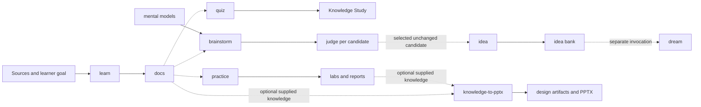

# Tianshu operating model

## Why it matters

Tianshu contains nine skills with different authority, outputs, and gates. Memorizing their names is not enough: effective use depends on recognizing what state should change, which artifact should own that change, and which workflow is authorized to create it.

## Concrete anchor

Imagine that you have read about retrieval-augmented generation and now want to understand it, test one claim, form a reusable decision model, generate product ideas, preserve one candidate, synthesize it with earlier ideas, and present the result. A single “help me with RAG” prompt hides seven different transformations. Tianshu separates them so sources, evidence, models, judgments, ideas, and slides do not silently overwrite one another's authority.

## Provisional mental model

Treat Tianshu as a **cognitive workshop** with specialized stations. Knowledge stations research and test; model stations create reusable reasoning; idea stations capture and synthesize; judgment stations compare candidates; the presentation station packages supplied knowledge. This model is provisional because the stations do not form one mandatory assembly line.

The diagram shows the major artifact relationships. Solid arrows are direct production within a skill; dotted arrows are optional inputs or separately invoked handoffs.

## Core concepts and mechanism

Start with the desired transformation, not with a familiar skill name. The skill catalog exposes a set of narrow contracts:

| Skill | Use it when | Durable result | Critical gate or boundary |
| --- | --- | --- | --- |
| `learn` | You need source-backed understanding | Indexed quick and deep tracks under `docs/` | Complete curriculum approval before research and writing |
| `quiz` | You want mastery review from existing learn output | Regenerable pack under `.learning/quiz/` plus canvas study state | Does not research, rewrite, or modify the curriculum |
| `practice` | You need evidence from a reproducible lab | Reusable lab README, factual report, optional evidence | Plan approval; extra confirmation for risky operations |
| `build-mental-model` | You need reusable explanatory or decision reasoning | Approved artifacts under `mental-models/` | Readiness and complete artifact approval before persistence |
| `idea` | You want to preserve raw wording faithfully | One new dated record under `ideas/` | No evaluation; no write when a secret is suspected |
| `dream` | You want bank-wide synthesis and conservative deduplication | Generated ideas, archives, and dated audit report | Separate explicit non-interactive run; archive only exact or fully subsumed records |
| `judge` | You need a model-grounded verdict for one intended use | Read-only reasoning report | No relevant durable model means `park`, not intuition |
| `brainstorm` | You need distinct, domain-grounded candidates | Read-only portfolio until explicit candidate selection | Each unchanged candidate is judged independently |
| `knowledge-to-pptx` | You need a designed presentation from supplied knowledge | Provenance/design/QA artifacts and PPTX | Semantic and deterministic gates block generation |

The mechanism follows four questions:

1. **What input is authoritative?** `learn` starts from a goal and validated sources; `quiz` starts from existing lessons; `judge` starts from an unchanged idea plus a durable model; `knowledge-to-pptx` starts from supplied knowledge.
2. **What state may change?** `judge` and most of `brainstorm` are read-only, while `idea`, `dream`, and artifact-producing skills own narrow destinations. Mutation authority is part of meaning, not a convenience.
3. **What gate protects the change?** Full plan approval, candidate selection, risky-operation confirmation, deterministic validation, or a narrowly constrained explicit invocation protects different risks.
4. **What artifact carries state forward?** Lessons, packs, reports, models, idea records, audit reports, design JSON, and decks have different evidence strength and regeneration rules.

> [!TIP]
> Phrase requests as “Use `<skill>` to transform `<input>` into `<owned output>` for `<purpose>`,” then name any boundary such as “stop before execution” or “do not write files.”

## Refined mental model

The workshop analogy correctly separates specialized responsibilities. It fails if it implies every artifact must pass through every station or that a conveyor automatically advances the work. Tianshu is better modeled as a **governed directed artifact graph**: each node has an owner, authority, validation rule, and mutation boundary; edges are explicit consumption or separate invocations.

The operational rule is: **choose the owner of the next durable state change**. If no state should change, prefer a read-only workflow or stop at a gate. If another artifact should consume the result, invoke its owning skill separately and pass the durable file rather than relying on conversational memory.

## Optional hands-on

Try it yourself

Classify five requests without running a skill: “save my exact idea,” “test whether this API behavior is real,” “decide whether the idea deserves expansion,” “turn approved lessons into flashcards,” and “combine duplicate ideas.” For each, name the owner, expected artifact, and gate. Compare your answers with the catalog table.

## Checkpoint questions

1. Why is `quiz` not the owner of curriculum truth?

Show answer 1

`quiz` deterministically projects selected sections from existing `learn` output into a regenerable pack. It must not research, summarize, or rewrite the source lessons, so `docs/` remains authoritative.

2. Why does a useful candidate from `brainstorm` not immediately become an idea record?

Show answer 2

`brainstorm` owns generation and judgment but remains read-only until the learner explicitly selects stable candidate IDs. The separate `idea` contract owns faithful persistence of selected wording.

3. In a new case, you have a lab report with surprising evidence and want slides. Must you rerun `learn` first?

Show answer 3

No. `knowledge-to-pptx` accepts supplied knowledge, so a validated lab report can be input directly. Updating lessons may still be useful if the report changes curriculum claims, but that is a separate owning workflow.

## Primary sources

- [Tianshu overview](../../../README.md)
- [Learn](../../../.github/skills/learn/SKILL.md)
- [Quiz](../../../.github/skills/quiz/SKILL.md)
- [Practice](../../../.github/skills/practice/SKILL.md)
- [Build mental model](../../../.github/skills/build-mental-model/SKILL.md)
- [Idea](../../../.github/skills/idea/SKILL.md)
- [Dream](../../../.github/skills/dream/SKILL.md)
- [Judge](../../../.github/skills/judge/SKILL.md)
- [Brainstorm](../../../.github/skills/brainstorm/SKILL.md)
- [Knowledge to PPTX](../../../.github/skills/knowledge-to-pptx/SKILL.md)

## Navigation

- [Prerequisite: Copilot skill sessions](../shared/01-copilot-skill-sessions.md)
- [Previous: Quick track index](README.md)
- [Next: Choose and chain skills](02-choose-and-chain-skills.md)
- [Quick track](README.md)
- [Topic root](../README.md)
- [Related deep module: System and artifact model](../deep/01-system-and-artifact-model.md)
