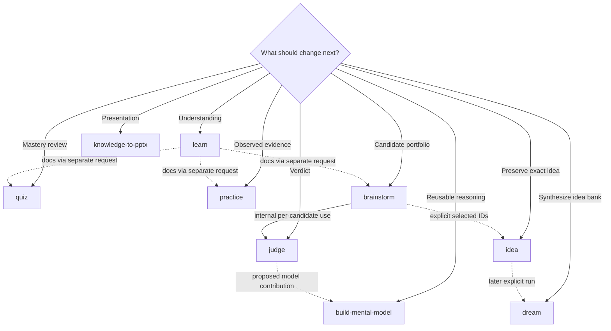

# Choose and chain skills

## Why it matters

The most common orchestration error is to treat a plausible next step as an automatic handoff. Tianshu instead uses durable artifacts and separate skill ownership, so the learner must select both the next transformation and the point at which to stop.

## Concrete anchor

Suppose `learn` has produced a source-backed topic under `docs/`. You could assess recall with `quiz`, test a claim with `practice`, use the material to ground `brainstorm`, or turn it into a presentation. These paths share an input but have different purposes, outputs, and authorization. “Continue” is therefore incomplete; the next request must name the desired state change.

## Provisional mental model

Treat each artifact as a **typed connector**. A lesson can connect to assessment, experimentation, ideation, or presentation, but the connector does not start the next machine. The learner chooses the consumer and supplies the artifact deliberately.

The graph distinguishes supported consumption from automatic execution. Dotted arrows require a separate request unless the label says the composition occurs inside one skill.

## Core concepts and mechanism

Use this goal-to-skill matrix before invoking anything:

| Desired next state | Skill | Required input | Stop condition |
| --- | --- | --- | --- |
| Source-backed curriculum exists | `learn` | Topic, outcome, learner context | Stop until the complete plan is approved |
| Existing lessons become a study experience | `quiz` | Unique topic and learn output | Stop if the source cannot be resolved or parsed |
| A claim gains observed evidence | `practice` | Bounded claim and authoritative foundations | Stop at plan approval, risk boundary, or blocker |
| Reasoning becomes reusable and testable | `build-mental-model` | Concrete use and case | Stop if readiness fails or approval is absent |
| Raw wording becomes durable | `idea` | One identifiable idea | Stop on ambiguity that changes meaning or suspected secret |
| The active idea bank is synthesized | `dream` | Explicit Dream invocation | Finish with completed, no-change, or partial-failure report |
| An unchanged idea receives a verdict | `judge` | Intended use and relevant durable model | Park when a basis gate is unresolved |
| A problem gains distinct judged candidates | `brainstorm` | Problem frame and repository knowledge | Stop before persistence unless IDs are selected |
| Supplied knowledge becomes a deck | `knowledge-to-pptx` | Knowledge and design constraints | Stop on any semantic, structural, generator, or fidelity gate |

Selection and chaining work step by step:

1. **Name the current durable artifact.** If there is none, describe the raw input and whether its exact wording matters.
2. **Name the next state, not merely an activity.** “Test claim X and preserve observed evidence” is more precise than “do something practical.”
3. **Choose the skill that owns that state.** Do not ask a read-only evaluator to save, or a capture skill to judge.
4. **Pass the artifact by path when possible.** A path makes provenance and freshness inspectable and reduces reliance on conversational memory.
5. **Re-enter the consumer's gates.** Approval in `learn` does not approve `practice`; selecting a brainstorm candidate does not approve a model artifact; Dream runs only when invoked explicitly.
6. **Record unsupported automation as a boundary.** `quiz` does not machine-transfer mastery into `practice`; `idea` does not automatically trigger `dream`; a `judge` contribution does not directly edit a mental model.
7. **Stop when ownership is unclear.** Clarify the intended state change rather than allowing the current skill to expand its authority.

## Refined mental model

Typed connectors explain why artifacts are reusable, but the analogy fails if it suggests compile-time enforcement. Tianshu contracts and validation provide discipline, yet the learner and agent still must identify authority, freshness, and supported transitions.

Use this refined rule: **a handoff is a new contract negotiation around an existing artifact**. The producer's completion establishes an input candidate, not authorization for the consumer. A reliable chain records the producer, artifact path, intended consumer, consumer gate, and stop condition.

## Optional hands-on

Try it yourself

Choose one existing file under `docs/` and write four no-execution handoff prompts: one for `quiz`, one for `practice`, one for `brainstorm`, and one for `knowledge-to-pptx`. Each prompt should name the path, intended transformation, and stop condition. Do not invoke the skills.

## Checkpoint questions

1. Why does completing `learn` not authorize a later lab execution?

Show answer 1

The learning plan governs curriculum research and writing. `practice` has a separate plan, execution boundary, safety preflight, and focused confirmation for risky operations, so it must negotiate its own authorization.

2. What is the only built-in reasoning composition in the idea and judgment flow?

Show answer 2

`brainstorm` applies the `judge` contract independently to every unchanged candidate. Persistence still requires explicit candidate selection and a handoff to `idea`.

3. In a new case, `judge` proposes a useful addition to a mental model. Why should it not edit the model directly?

Show answer 3

`judge` is read-only and its contribution is only a candidate. A separate `build-mental-model` refinement must inspect dependencies, pass readiness and regression checks, and obtain approval before changing the canonical artifact.

## Primary sources

- [Tianshu overview](../../../README.md)
- [Brainstorm workflow](../../../.github/skills/brainstorm/SKILL.md)
- [Judge workflow](../../../.github/skills/judge/SKILL.md)
- [Idea workflow](../../../.github/skills/idea/SKILL.md)
- [Dream workflow](../../../.github/skills/dream/SKILL.md)
- [Quiz workflow](../../../.github/skills/quiz/SKILL.md)
- [Practice workflow](../../../.github/skills/practice/SKILL.md)

## Navigation

- [Prerequisite: Tianshu operating model](01-tianshu-operating-model.md)
- [Previous: Tianshu operating model](01-tianshu-operating-model.md)
- [Next: Guided run and recovery](03-guided-run-and-recovery.md)
- [Quick track](README.md)
- [Topic root](../README.md)
- [Related deep module: Cross-skill orchestration](../deep/07-cross-skill-orchestration.md)
