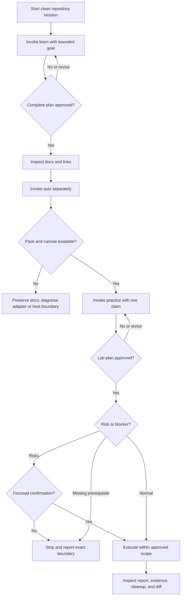

# Guided run and recovery

## Why it matters

Knowing the catalog does not guarantee reliable execution. A useful operating playbook must make gates observable, predict artifacts before they appear, and preserve honest partial states when a source, destination, permission, or validation blocks the run.

## Concrete anchor

Use a small topic such as HTTP caching for a guided knowledge loop. The intended sequence is: create approved learning material, derive a quiz pack, propose a bounded lab, and stop before any risky execution. During the run, imagine four interruptions: an ambiguous prerequisite answer, an existing topic directory, a missing canvas, and absent credentials for the proposed lab.

## Provisional mental model

Treat the workflow as a **flight plan with checkpoints**. At each checkpoint, compare the expected state with the observed state before proceeding. This is provisional because different skills have different terminal states: a blocked lab report can be correct, while writing unapproved learning material cannot.

The flow shows the happy path and the recovery branch at every boundary.

## Core concepts and mechanism

Before each step, predict the artifact and the gate:

| Checkpoint | Expected artifact or observation | Failure signal | Safe action |
| --- | --- | --- | --- |
| Session start | Clean or understood Git status; project skills visible | Unknown existing changes or missing skill | Inspect without reverting; reload or verify skill scope |
| Learn clarification | One focused question at a time | Material ambiguity remains | Answer or narrow the goal; do not approve a guessed plan |
| Learn approval | Full goal, prerequisites, both tracks, visual/table decisions, file map | Summary-only plan or early write | Request the complete plan and restore the gate |
| Learn completion | Indexed topic root, independent tracks, sources, valid links | Collision, unsupported claim, orphan page | Choose merge/new slug/stop; fix validation before handoff |
| Quiz adaptation | Manifest, knowledge pack, opened study canvas | Parser failure, ambiguous topic, unavailable canvas | Preserve source docs; resolve the exact adapter or host issue |
| Practice approval | Bounded experiment, success/negative criteria, evidence, cleanup | Vague “try it” plan | Revise before creating or executing |
| Practice preflight | Credentials checked by presence, cost/safety boundaries known | Missing credential or undisclosed risky command | Mark blocked or request focused confirmation |
| Completion | Honest terminal state and inspectable diff | Success-shaped fallback or missing evidence | Preserve failure, contradiction, last completed step, and next prerequisite |

Run the scenario in controlled steps:

1. **Establish a baseline.** Start a repository-backed session and inspect existing changes. Never treat unrelated user work as cleanup material.
2. **Bound the learning target.** Ask `learn` for one practical outcome, answer prerequisite questions once, and inspect the complete learner-facing plan.
3. **Approve only the visible contract.** If the destination already exists, choose the skill's safe collision strategy rather than allowing replacement by implication.
4. **Verify learning output before chaining.** Confirm the topic index, quick and deep entry points, source links, and Git diff.
5. **Invoke `quiz` separately.** If the deterministic pack builds but the canvas is unavailable, retain the pack and report the host boundary; do not rewrite lessons to hide it.
6. **Invoke `practice` around one claim.** Approve a plan only when semantic success, meaningful negative outcome, evidence, stop conditions, and cleanup are explicit.
7. **Stop honestly at blockers.** Missing credentials produce a blocked report or a pre-execution stop, not invented observations. A risky operation requires a focused confirmation even after overall plan approval.
8. **Close with evidence.** Compare expected and observed behavior, inspect cleanup, and link contradictions back to the owning learning material only through an approved update.

> [!WARNING]
> Do not resolve a collision by deleting an existing topic, lab, model, idea, or presentation directory unless the owning skill offers that exact strategy and the learner explicitly approves it.

## Refined mental model

The flight-plan analogy correctly emphasizes checkpoints and stop conditions. It fails if every stop is treated as failure: `park`, `blocked`, `partial failure`, and `no change` are sometimes the most truthful terminal states.

Use this refined control loop: **predict → authorize → act → observe → classify → preserve**. Recovery begins by preserving the last trustworthy artifact and identifying the failed boundary. Resume at that boundary with the owning skill; do not rerun downstream steps or manufacture success-shaped output.

## Optional hands-on

Try it yourself

Perform the scenario as a paper simulation. Write the expected path, gate, and artifact for `learn`, `quiz`, and `practice`. Then assign one interruption to each stage and state the honest terminal status and exact resumption input. If you use a real session, stop before approving writes or execution.

## Checkpoint questions

1. A topic directory already exists before `learn` writes. What is the safe response?

Show answer 1

Inspect and summarize the collision, then ask the learner to choose a compatible merge, a new slug, or stop. Replacement is not implied by plan approval and should be offered only when explicitly requested.

2. A lab cannot authenticate because credentials are absent. Why is `blocked` a valid outcome?

Show answer 2

The workflow can still preserve the approved protocol, completed preflight, exact blocker, last completed step, and next prerequisite. Inventing later observations would be less complete and less truthful.

3. In a new case, presentation design validation emits only warnings. May generation continue?

Show answer 3

No. The presentation contract treats warnings as blocking, so the design must be repaired and revalidated before generation.

## Primary sources

- [Learn collision and output contract](../../../.github/skills/learn/references/learning-output.md)
- [Quiz contract](../../../.github/skills/quiz/SKILL.md)
- [Practice contract](../../../.github/skills/practice/SKILL.md)
- [Practice execution safety](../../../.github/skills/practice/references/execution-safety.md)
- [Build mental model artifact system](../../../.github/skills/build-mental-model/references/artifact-system.md)
- [Knowledge-to-PPTX contract](../../../.github/skills/knowledge-to-pptx/SKILL.md)

## Navigation

- [Prerequisite: Choose and chain skills](02-choose-and-chain-skills.md)
- [Previous: Choose and chain skills](02-choose-and-chain-skills.md)
- [Quick track](README.md)
- [Topic root](../README.md)
- [Related deep module: Safety, recovery, and maintenance](../deep/08-safety-recovery-and-maintenance.md)
- [Related deep module: End-to-end capstone](../deep/09-end-to-end-capstone.md)
