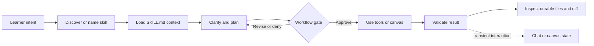

# Copilot skill sessions

## Why it matters

Tianshu's workflows run through Copilot, but the durable result lives in repository artifacts rather than in the conversational transcript. Without a clear model of skills, sessions, tools, canvases, and files, a learner can approve the wrong operation, mistake a chat answer for finished work, or lose context that should have been persisted.

## Concrete anchor

Suppose you open the Tianshu repository and type, “Use the `/learn` skill to teach me cache invalidation.” Copilot identifies the project skill, loads its instructions, asks focused questions, presents a complete curriculum for approval, researches after approval, uses editing tools, and leaves a Git diff under `docs/`. The observable result is not merely the final chat message: it is the approved, inspectable file set and the evidence that its checks passed.

## Provisional mental model

Treat a Copilot session as a **workbench**, a skill as a **checked-in runbook**, tools as the **hands**, a canvas as a **shared instrument panel**, and repository artifacts as the **workpieces you keep**. This model is provisional because Copilot chooses and interprets runbook steps rather than executing them like a deterministic shell script.

The lifecycle below shows where each part enters. The learner controls the intent and gates; the skill organizes the workflow; tools and canvases perform work; Git-visible files preserve the result.

## Core concepts and mechanism

An Agent Skill is a directory whose `SKILL.md` supplies a name, description, and task-specific instructions, with optional supporting resources. Project skills can live under `.github/skills/`, so opening this repository gives Copilot a discoverable catalog. Naming a skill explicitly, such as “Use the `/learn` skill,” reduces routing ambiguity, but the model still interprets the request and the skill contract.

The interaction surfaces have different responsibilities and persistence:

| Surface | Primary purpose | State and persistence | Learner responsibility |
| --- | --- | --- | --- |
| Chat | Scope, explain, brainstorm, or steer | Saved conversation; no dedicated branch or worktree | Do not treat prose alone as a durable deliverable. |
| Session | Perform repository-backed work | Conversation plus isolated workspace, branch, tools, and changes | Choose an appropriate mode and inspect the diff. |
| Skill | Supply a reusable workflow contract | Loaded instructions and supporting resources | Invoke the skill matching the desired transformation. |
| Tool | Read, edit, execute, fetch, or call a service | Tool-specific result; may mutate the workspace or external state | Review permissions and consequential targets. |
| Canvas | Share interactive state with the agent | Host- and extension-specific state | Distinguish canvas progress from Git-tracked output. |
| Repository artifact | Preserve lessons, models, ideas, reports, or decks | Durable, reviewable, and versionable file | Verify content, links, evidence, and destination. |

The mechanism is a sequence of ownership transfers:

1. **Start in the repository.** A repository-backed session gives the agent the project skills and a workspace in which artifacts can be inspected with Git.
2. **State a concrete outcome.** “Teach me X,” “capture this idea,” and “judge this proposal for Y” route to different contracts because the intended state change differs.
3. **Confirm skill discovery.** Copilot can route automatically, but explicit invocation and `/skills` inspection make the selected workflow observable. Reload skills after changing their files.
4. **Let the skill clarify only what changes the work.** Tianshu skills commonly ask one focused question at a time; the question is part of the workflow, not a failure to start.
5. **Distinguish host mode from skill gates.** Interactive, plan, or autopilot modes control host autonomy. They do not replace a Tianshu skill's own visible approval, candidate selection, collision decision, or risky-operation confirmation.
6. **Review tool permissions.** A skill can instruct Copilot to edit or execute, but tools provide the capability. Permission should match the exact operation; broad shell pre-approval is inappropriate for unreviewed skills or scripts.
7. **Inspect the durable result.** Read the changed files, their links, and their validation evidence. A completion sentence is a claim to verify, not proof.
8. **Resume from artifacts when possible.** Conversation history helps continue a session, but files are the durable contract between sessions and between skills.

> [!IMPORTANT]
> Official app documentation confirms project-skill availability, but custom-skill visibility in every slash-command picker and the availability of Tianshu's `ask_user` and canvas surfaces can vary by host version and organization policy. Verify them in the installed environment rather than assuming picker behavior.

## Refined mental model

The workbench analogy maps accurately to separation of responsibilities: the session holds working state, the skill supplies procedure, tools act, and artifacts persist. It fails if it suggests a fixed operator following a deterministic script. Copilot performs model-mediated routing and execution, tools may require permission, external services may be unavailable, and every Tianshu skill has its own gates and mutation boundary.

Use this operational model instead: **intent selects a contract; the contract negotiates scope and authorization; capabilities perform bounded actions; validation produces evidence; artifacts carry durable state forward**. When troubleshooting, identify which link failed rather than repeating the entire prompt.

## Optional hands-on

Try it yourself

Run a no-write discovery check in a disposable session. Record `git status --short`, inspect `/skills`, ask for information about the `learn` skill, and begin a small `/learn` request. Stop at its learner-facing plan approval prompt, confirm that the worktree is unchanged, and write down which state exists only in the conversation. Do not approve the plan during this exercise.

## Checkpoint questions

1. Why is a skill not equivalent to a shell command?

Show answer 1

A skill supplies contextual instructions that Copilot interprets. Tools provide actual read, edit, execution, and service capabilities, so results depend on routing, context, permissions, tool availability, and validation rather than deterministic command semantics.

2. Why does selecting host Plan mode not satisfy the `learn` skill's approval gate?

Show answer 2

Host mode controls how the session operates, while `learn` requires its own complete learner-facing curriculum and explicit approval before substantive research or writes. These are separate layers of authorization.

3. In a new case, Copilot displays quiz progress in a canvas but no files change. What should you conclude about persistence?

Show answer 3

Conclude only that the canvas holds interactive progress according to its extension contract. Do not infer that progress is Git-tracked; inspect the repository and the canvas's documented persistence separately.

## Primary sources

- [About Agent Skills](https://docs.github.com/en/copilot/concepts/agents/about-agent-skills), GitHub Docs, retrieved 2026-08-19.
- [Add Agent Skills to GitHub Copilot CLI](https://docs.github.com/en/copilot/how-tos/copilot-cli/customize-copilot/add-skills), GitHub Docs, retrieved 2026-08-19.
- [Agent sessions in the GitHub Copilot app](https://docs.github.com/en/copilot/how-tos/github-copilot-app/agent-sessions), GitHub Docs, retrieved 2026-08-19.
- [Allowing tools in GitHub Copilot CLI](https://docs.github.com/en/copilot/how-tos/copilot-cli/use-copilot-cli/allowing-tools), GitHub Docs, retrieved 2026-08-19.
- [Working with canvas extensions](https://docs.github.com/en/copilot/how-tos/github-copilot-app/working-with-canvas-extensions), GitHub Docs, retrieved 2026-08-19.
- [Tianshu overview](../../../README.md)
- [Learn skill contract](../../../.github/skills/learn/SKILL.md)

## Navigation

- [Topic root](../README.md)
- [Quick track](../quick/README.md)
- [Next quick module: Tianshu operating model](../quick/01-tianshu-operating-model.md)
- [Deep track](../deep/README.md)
- [Next deep module: System and artifact model](../deep/01-system-and-artifact-model.md)
